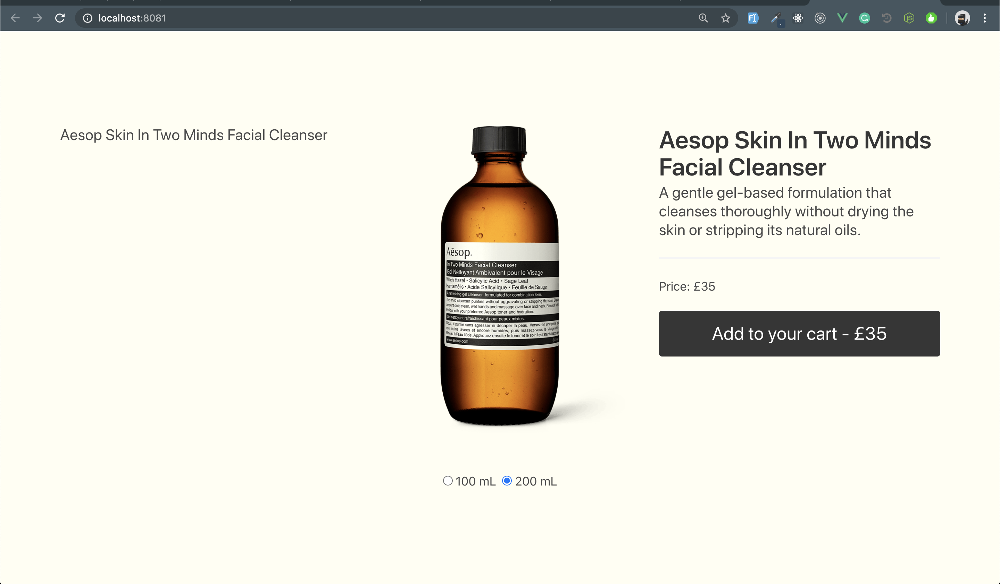
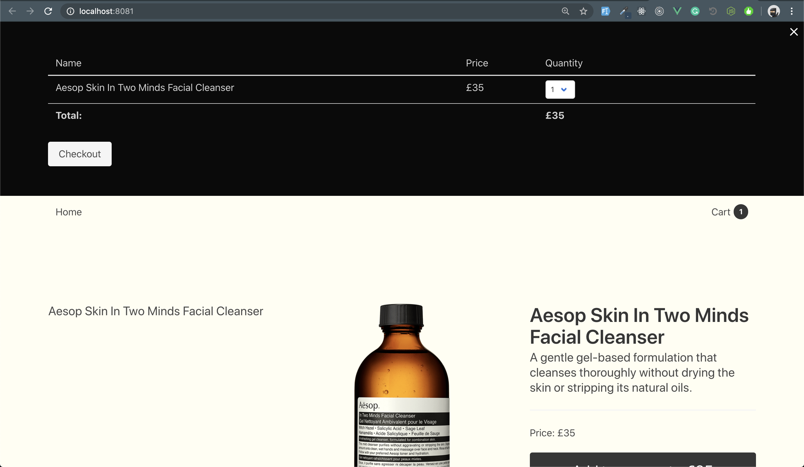

# Rotate

## Project setup

```
yarn install
```

### Compiles and hot-reloads for development

```
yarn serve
```

### Compiles and minifies for production

```
yarn build
```

### Run your unit tests

```
yarn test:unit
```

### Lints and fixes files

```
yarn lint
```

## Description

- I replicated the shopping cart and product switcher, using Vue, Vuex, TypeScript and local API mock in `apis` directory.
- I stored Vuex store in `Local Storage`, so if you refresh the page with items in the cart, the items will remain there. If you changed the code remember to clear the local storage.
- There are photos in `assets` directory.
- The cart will be opened from the top using `toggleCart` in Vuex and same as prototype given.
- I could extract the Store into modules, but the app didn't need that complexity.
- I could have used Jest and Vue-test-utils to write some test.

- URL you have given me to replicate: https://www.aesop.com/uk/p/skin/cleanse/in-two-minds-facial-cleanser/
- Screen shot of what I produced:



#### Time spent: 5 hours
